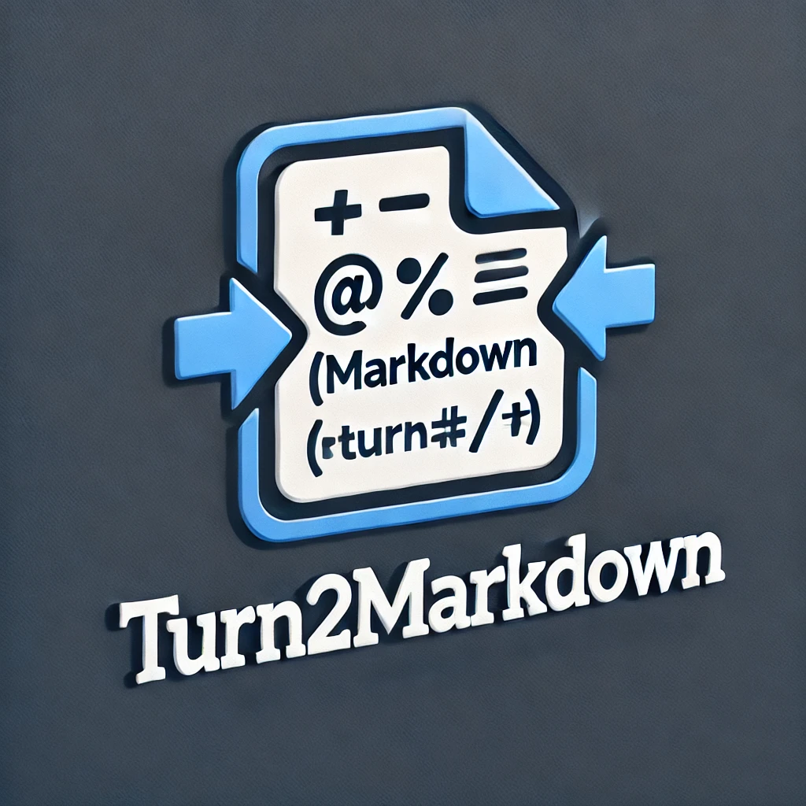

# Turn2Markdown

<p align="center">
  
</p>

<div align="center">

[](https://github.com/SeimoDev/Turn2Markdown)
[](LICENSE)

[English](#english) | [简体中文](#简体中文)

[Server | 后端](https://github.com/SeimoDev/Turn2Markdown-Server)
</div>

## English

### Introduction
Turn2Markdown is a powerful web tool that converts Office documents (DOCX, PDF, XLSX, PPTX) into Markdown format. Built with Vue 3 and Ant Design Vue, it provides a clean and intuitive interface for easy document conversion.

### Features
- 🚀 Quick conversion of Office documents to Markdown
- 📄 Supports multiple file formats (DOCX, PDF, XLSX, PPTX)
- 💡 Simple and intuitive user interface
- 🌓 Dark mode support
- 📱 Responsive design for all devices

### Quick Start
1. Visit the website
2. Click "Choose File" to select your document
3. Click "Start Convert" to begin conversion
4. Download the converted Markdown file

### Development
```bash
# Install dependencies
npm install

# Start development server
npm run dev

# Build for production
npm run build
```

### Tech Stack
- Vue 3
- Vite
- Ant Design Vue
- Axios

### License
This project is licensed under the GPL v3 License - see the [LICENSE](LICENSE) file for details.

---

## 简体中文

### 简介
Turn2Markdown 是一个强大的网页工具，可以将 Office 文档（DOCX、PDF、XLSX、PPTX）转换为 Markdown 格式。使用 Vue 3 和 Ant Design Vue 构建，提供清晰直观的界面，让文档转换变得简单。

### 特性
- 🚀 快速将 Office 文档转换为 Markdown
- 📄 支持多种文件格式（DOCX、PDF、XLSX、PPTX）
- 💡 简单直观的用户界面
- 🌓 支持深色模式
- 📱 适配所有设备的响应式设计

### 快速开始
1. 访问网站
2. 点击"选择文件"选择您的文档
3. 点击"开始转换"开始转换
4. 下载转换后的 Markdown 文件

### 开发
```bash
# 安装依赖
npm install

# 启动开发服务器
npm run dev

# 构建生产版本
npm run build
```

### 技术栈
- Vue 3
- Vite
- Ant Design Vue
- Axios

### 许可证
本项目基于 GPL v3 许可证开源 - 查看 [LICENSE](LICENSE) 文件了解更多详情。
